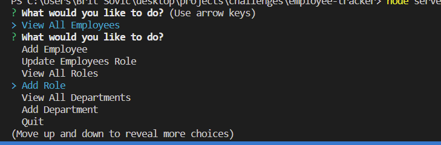

# employee-tracker

## Project Description

This project is a backend node.js project using the Inquierer npm and mysql to create a directory of options for employee/department functions.

## Tools Used In This Project

* JavaScript
* Inquierer npm
* node.js
* mysql

## Deployed Application

(video)

## Future Development

* I would like to add more options related to the field of healthcare since the department options/employee options revolved around
my field in healthcare.

## Screenshots

